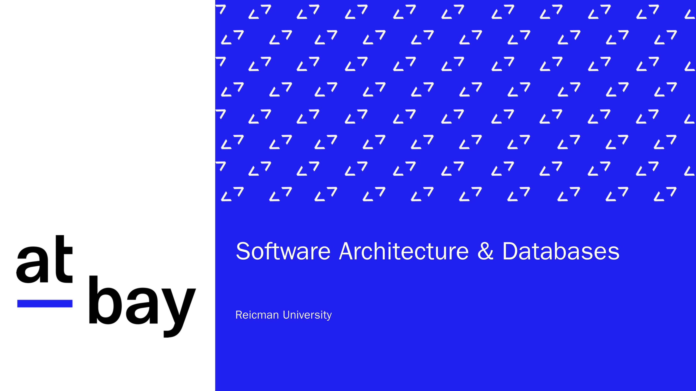
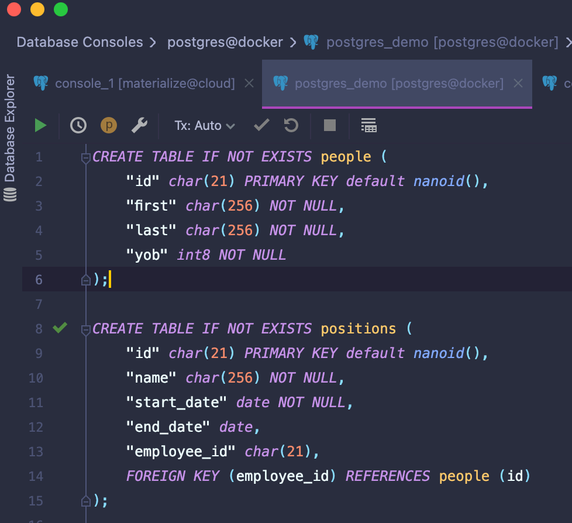
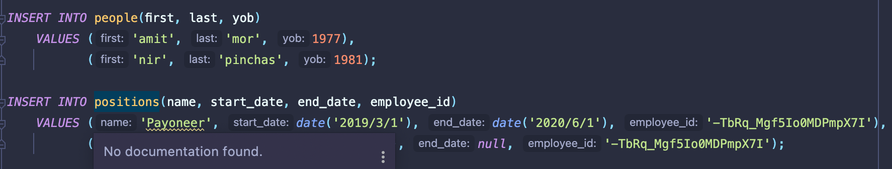
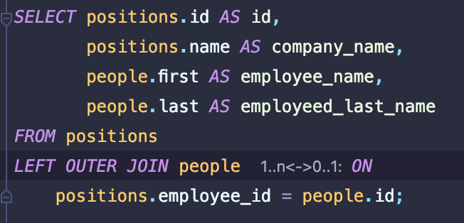
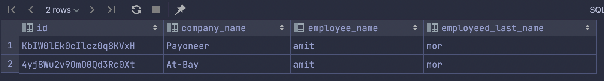
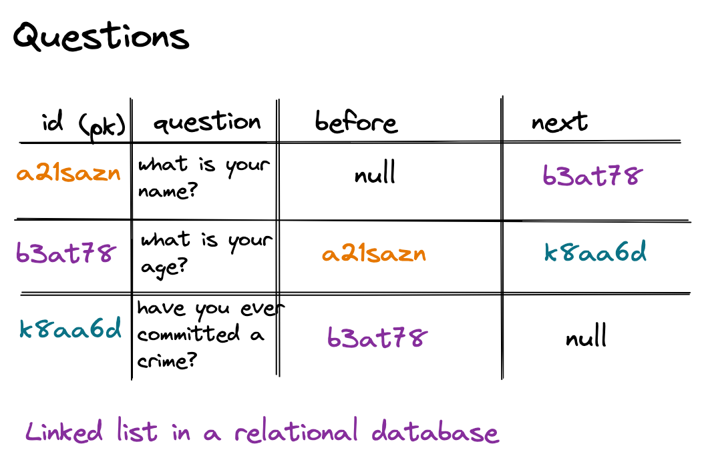
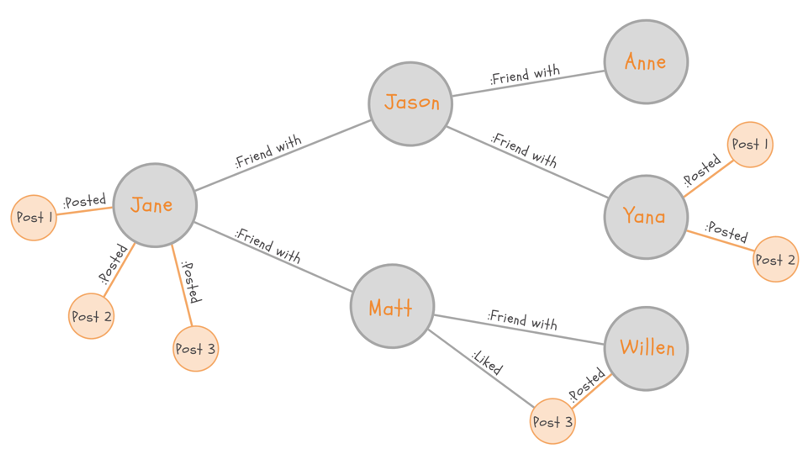
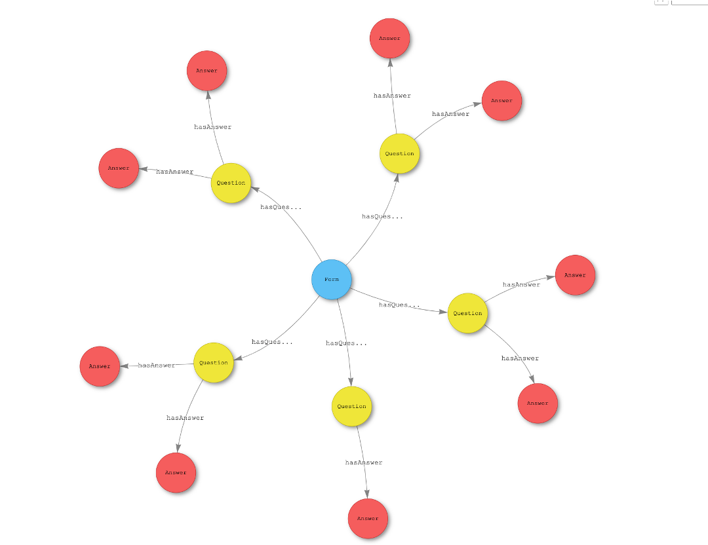
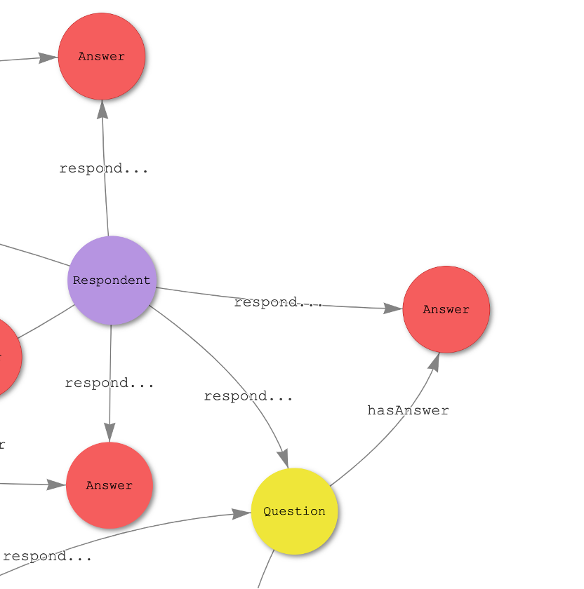
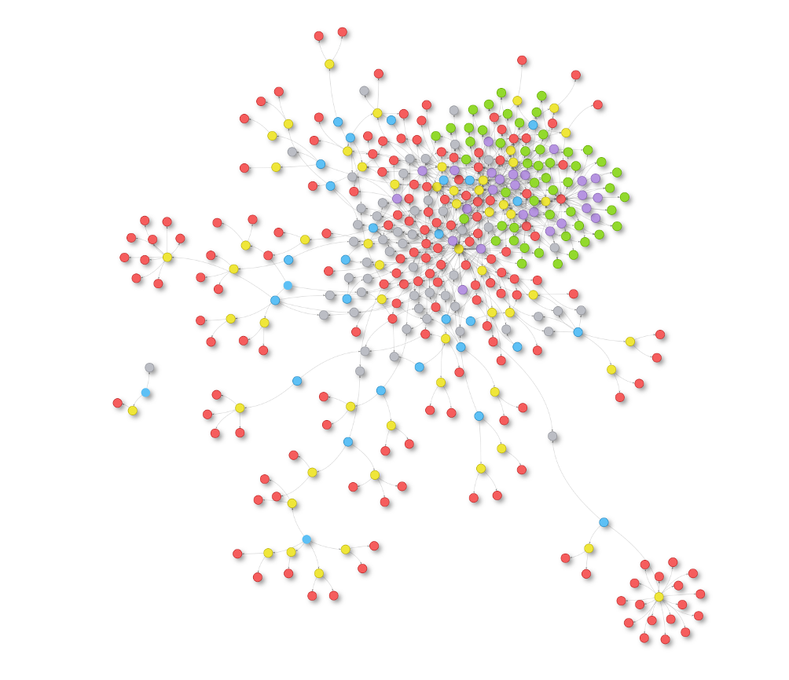

<!-- _paginate: false -->



---
<!-- paginate: true -->

# Contact Me

amitm
@
at-bay.com

### Feel free to drop me your comments, suggestions, questions

---

# Nice to Meet You!

* Life: 45 yo, married + 3 kids, live in Shoham, Yoga.
* Current: 2 yrs @ [At-Bay](https://at-bay.com) as a Software Architect (...what's that?)
* Overall: ~15 yrs in the industry, mostly in startups, but fallen a couple of times to the corporate hands
* Fun time 1: Does Tech Due Diliginces for a couple of VCs
* Fun time 2: Contributor to the [Dapr](https://dapr.io) open source project
* Fun time 3: this thing


---

# What We'll Talk About


* Software architecture - theory
* Where theory meets reality
* The oh-so-boring SaaS company
* The *relational database* as the greatest invention in industrial software engineering
* Where the relational database *fails*
* Q & A

---

# Software Architecture

## Wikipedia 
* "Software architecture refers to the fundamental <span style="color:blue;">structures</span> of a software <span style="color:blue;">system</span> and the <span style="color:purple;">discipline</span> of creating such structures and systems." 
* "Each <span style="color:blue;">structure</span> comprises software <span style="color:red;"> elements</span>, <span style="color:red;"> relations </span> among them, and <span style="color:purple;">properties</span> of both elements and relations."

* system:
    * structures: 
        * element <-- relation --> element

---

# Software Architecture
## Somebody Needs to Choose... ("System Analysis")

* "Software architecture is about making fundamental structural __choices__ that are <span style="color:red;">costly to change once implemented</span>" (wikipedia, this time getting it right)
* What's costly to change (over time):
    * Programming Language (changing/adding mostly breaks common tools) --> "element"
    * <span style="color:blue">Data Model</span> (breaks everything if done wrong) --> "property of an element"
    * Runtime Environment (on-prem vs cloud x/y/z) --> "structure+system"
    * Contracts (APIs) --> "relations"

---

# Software Architecture

## Conceptualization & Creation of New Things ("System Design")
* "Fighting" the windmills of **complexity** as software obeys the 2nd law of thermodynamics (complexity never decreases) 

* But what is complex? ("This part of the codebase doesn’t *feel* right!")
* When do you surrender to the evil called "management"?
* The humanity! (You care about people not losing their minds)
---
# Software Architecture
## Reviewing Things ("Evaluation")

* High Level Design Review - system
* Code Reviews - quality
* Security Reviews - security safety
* Test Review - code safety
* Data Modeling Review - correct abstraction/database performance
* Data Integration Review - none applicative systems
* DevOps Review - environment/deployment
* SRE Review - gauges

<span style="color:blue"> Make sure stuff alines with your company *vision* and *business status* on how software is being made </span>

---
# Software Architecture
## Redesign Bad Stuff Other People Did ("Evolution")
* Fun/easy stuff is to do *NEW* things
* NotSoFun/hardest stuff is to evolve *OLD* things
* Read about: "evolutionary architecture" 
---

# Ope There Goes Gravity (E. minem)

* The ideal picture is a fantasy
* You have to __surrender__ to accepting these:
    * You and your work are __not__ __eternal__
    * There is no ״generic״ best architecture
    * Even the "best" code is eventually __thrown__ to the recycle bean 
    * You are working for a company that in its essence is a machine made to make __profit__
    * At the broader perspective, *individual contributions*, are __irrelevant__. Collaboration is key. 
* None of the above is in contradiction to software development being a beautiful human mental act

---
# The Oh-So-Boring SaaS Company

* Capture *Data*
* Do something over *Data*
* Arrange the *Data* nicely
* Ask for money from customers/advertisers


---

# The Data Model

## Data Model = Database Tables

* It is how you model the business (entities)

* **It is the single most important element in the system design of a SaaS**

* It is the only effort worth investing BEFORE writing a single line of code (atypical for a startup to do)

* Still, it is ever **evolving** with the business needs, but once in use, *it is hard to change*

* Things that aren't persisted are potentially lost, so the use of in-memory data structures (with all due respect to BigO) is just temporary and the **significant stateful operations are done over a database**


---
# Data Model - Implementation
Usually, we're talking about a *Relational Database* 


---
# Relational Databases
The founding father of the relational model is *Edgar F. Codd*

* Based on his work published in 1970 (yes, 52 yo technology) while he was working for IBM
* He won the Turing Award in 1981 for this work
* He applied Relational Algebra and proposed such an algebra as a basis for database query languages
* Five primitive operators: selection, projection, Cartesian product (also called cross join), set union, set difference.


---

# Relational Databases - Basics

* Relational databases are all about __tables__
* Tables are able to _relate_ to one another


---

# Relational Databases - Basics 2


* Use a __declarative__ language to apply operations over the logical representation and don't mind the physical aspects


* Ability to create meaningful information by __joining__ of tables


* To ensure that data is always accurate and accessible, relational databases follow certain integrity rules (__A.C.I.D__)

* Relational databases are __transactional__—they guarantee the state of the entire system is consistent at any moment

* The relational model means that the *logical data structures*—the data tables, views, and indexes—are separate from the *physical storage structures*


---

# Relational Databases - __Declarative__ __Language__





---

# Relational Databases - __JOINS__






---

# Relational Databases - Transactions & __A.C.I.D__

ACID = Atomicity, Consistency, Isolation, Durability


__Atomicity__ - a guarantee that either all of the transaction succeeds or none of it does. “all or nothing”. 
__Consistency__ - All data will be valid according to all defined rules, including any constraints, cascades, and triggers that have been applied on the database.
__Isolation__ - a transaction cannot read data from any other transaction that has not yet completed.
__Durability__ - once a transaction is committed, it will remain in the system – even if there’s a system crash immediately following the transaction

---

# Relational Databases - In Practice


* You'd rarely find a company using "raw" SQL queries as it is considered error prone

* Most likely a company would use an ORM framework of some sorts

* ORM - Object (to) Relational Mapping - Libraries that abstract away the SQL expressions and allow to use a more programmatic access to data
    * Python - Django, SQLAlchemy
    * Java - Hibernate

* Python Django (similar to the left join demonstrated above): 
    ```python
    Positions.objects.filter(people__id='KbIW0l..')
    ```

---

# When the Relational Model Breaks



---

# Graph Databases

* Databases that uses __graph__ __structures__ to store data. The graph is build by nodes and edges (relationship).
* Common query languages are: Cypher, Gremlin and SparQL.
* Offers ACID transaction guarantees
* Schema-less 
* Excel at recursive, graph data structures

 
 ---

# Modeling Questions on a Graph Database



---

# Modeling a Respondent 



---

# That's a Questionnaire



---

# At-Bay

* An insure-tech startup (5 yo)
* Raised > 200M\$; Evaluated > 1.3B\$
* x3 people in 2 years, 76 people in tlv
* working hybrid, people from north, south and center
* very diverse and heterogeneous skills are around
* best phase to do interesting things (got the money, customers and scaling the tech)
* trying to do good
* looking for back/front/full-end devs,cyber researchers, data/ml engineers

---
# Literature

* wikipedia
* http://users.ece.utexas.edu/~perry/work/papers/swa-sen.pdf
* https://www.goodreads.com/book/show/296981.Object_Oriented_Software_Engineering
* https://thevaluable.dev/fighting-software-entropy/
* [E.F. Codd paper](https://www.seas.upenn.edu/~zives/03f/cis550/codd.pdf)