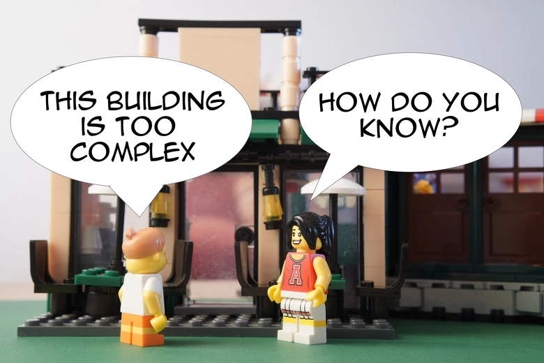
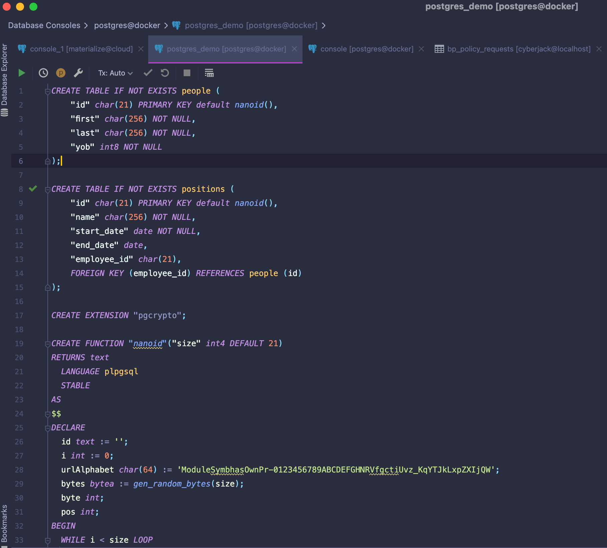

# Front Matter
<!-- _paginate: false -->
a dot com

---
<!-- paginate: true -->

# Outline

* Item 1
* Item 2
* Item 3

---

# Nice to Meet You!

* Life: 45 yo, married + 3 kids, live in Shoham, Yoga.
* Work: 
    * Current: 2 yrs @ [At-Bay](https://at-bay.com) as a Software Architect (...what's that?)
    * Overall: ~15 yrs in the industry, mostly in startups, but fallen a couple of times to the corporate hands
    * Fun time 1: Does Tech Due Diliginces for a couple of VCs
    * Fun time 2: Contributor to the [Dapr](https://dapr.io) open source project
    * Fun time 3: this thing
* Formal: 
    * B.Sc in Biotechnology & Environmental Science from Tel-Hai College 
    * M.Sc in Biochemistry from Weizmann Institute of Science
    * Ph.D studies in Biophysics (I didn't complete) from Weizmann

---

# What We'll Talk About

* Software architecture - theory
* We theory meets reality
* The oh-so-boring SaaS company
* The *relational database* as the greatest invention in industrial software engineering
* Where the relational database *fails*
* Q & A

---

# Software Architecture

## Wikipedia 
* "Software architecture refers to the fundamental structures of a software system and the discipline of creating such structures and systems." 
* "Each structure comprises software  elements,  relations  among them, and properties of both elements and relations."

* system:
    * structures: 
        * element <-- relation --> element

---

# Software Architecture
## Static Analysis of a System

* "Software architecture is about making fundamental structural choices that are costly to change once implemented" (wikipedia, this time getting it right)
* What's costly to change (over time):
    * Programming Language (changing/adding mostly breaks common tools) --> "element"
    * Data Model (breaks everything if done wrong) --> "property of an element"
    * Runtime Environment (on-prem vs cloud x/y/z) --> "structure+system"
    * Contracts (APIs) --> "relations"

---

# Software Architecture

## System Design
* "Fighting" the windmills of **complexity** as software obeys the 2nd law of thermodynamics (complexity never decreases) 

* But what is complex? ("This part of the codebase doesn’t *feel* right!")
* When do you surrender to the evil called "management"?
* The humanity! (You care about people not losing their minds)
---
# Software Architecture
## Evaluation

Also know as **reviewing things**:
* High Level Design Review - system
* Code Reviews - quality
* Security Reviews - security safety
* Test Review - code safety
* Data Modeling Review - correct abstraction/database performance
* DevOps Review - environment/deployment
* SRE Review - gauges

 Make sure stuff alines with your company *vision* on how software is being made 

---
# Software Architecture
## Evolution
* Fun/easy stuff is to do *NEW* things
* NotSoFun/hardest stuff is to evolve *OLD* things
* Read about: "evolutionary architecture" 
---

# Ope There Goes Gravity (E. minem)

* The ideal picture is a fantasy
* You have to __surrender__ to accepting these:
    * You and your work are __not__ __eternal__
    * There is no ״generic״ best architecture
    * Even the "best" code is eventually __thrown__ to the recycle bean 
    * You are working for a company that in its essence is a machine made to make __profit__
    * שׁt the broader picture, *individual skills*, are __irrelevant__. Collaboration is key
* None of the above is in contradiction to software development being a beautiful human mental act

---
# The Oh-So-Boring SaaS Company

* Capture *Data*
* Do something over *Data*
* Arrange the *Data* nicely
* Ask for money from customers/advertisers

---

# The Data Model

## Data Model == Database Tables

* It is how you model the business entities

* **It is the single most important element in the system design of a SaaS**

* It is the only effort worth investing BEFORE writing a single line of code (atypical for a startup to do)

* Still, it is ever evolving with the business needs, but once in use, *it is hard to change*

* Things that aren't persisted are potentially lost, so the use of in-memory data structures (with all due respect to BigO) is just temporary and the **significant stateful operations are done over a database**

---
# Data Model - Implementation
Usually, we're talking about a *Relational Database* 

---
# Relational Databases
The founding father of the relational model is *Edgar F. Codd*

* Based on his work published in 1970 (yes, 52 yo technology) while he was working for IBM
* He won the Turing Award in 1981 for this work
* He applied Relational Algebra and proposed such an algebra as a basis for database query languages
* Five primitive operators: selection, projection, Cartesian product (also called cross join), set union, set difference.

---

# Relational Databases - Basics

* Relational databases are all about __tables__
* Tables are able to _relate_ to one another

---

# Relational Databases - Basics 2

* Use a __declarative__ language to apply operations over the logical representation and don't mind the physical aspects

* Ability to create meaningful information by __joining__ of tables

* To ensure that data is always accurate and accessible, relational databases follow certain integrity rules (__A.C.I.D__)

* Relational databases are __transactional__—they guarantee the state of the entire system is consistent at any moment

* The relational model means that the *logical data structures*—the data tables, views, and indexes—are separate from the *physical storage structures*

// todo: move these two

*  You'd rarely find a company using "raw" SQL queries as it is considered error prone 

*   Most likely a company would use an ORM framework of some sorts 
---

# Relational Databases - __Declarative__ __Language__

---

# Relational Databases - __JOINS__

---

# Relational Databases - __A.C.I.D__

---
# Relational Databases - Example

## TODO ERD of Customers and Orders tables

---

# Relational Database - Transactions & 2PC

The only model that is able to guarantee correctness of a system

A query from my service over the data ALWAYS produces the same result as from another service

The cost is database row/table locking and performance hit (which is nowadays negligible)

This is key for a company that can't accept eventual consistency (regulatory) or that it's business flow is sequential

ACID

---
# Literature

* wikipedia
* http://users.ece.utexas.edu/~perry/work/papers/swa-sen.pdf
* https://www.goodreads.com/book/show/296981.Object_Oriented_Software_Engineering
* https://thevaluable.dev/fighting-software-entropy/
* [E.F. Codd paper](https://www.seas.upenn.edu/~zives/03f/cis550/codd.pdf)